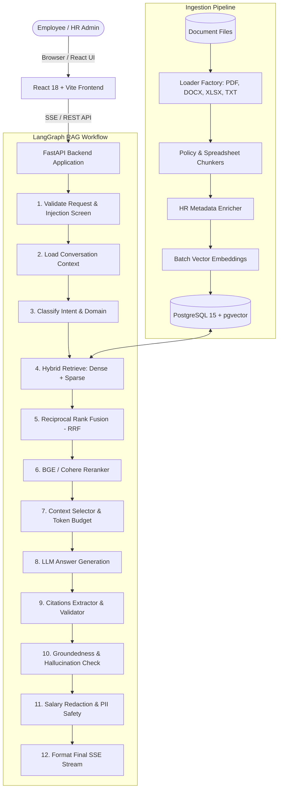

# System Architecture: HR Knowledge Assistant RAG

## High-Level Architecture Overview

## Hybrid Retrieval & RRF Fusion

1. **Dense Vector Search**: Computes cosine distance using pgvector HNSW index (`ef_construction=128, m=16`).
2. **Sparse Full-Text Search**: Uses PostgreSQL `tsvector` generated column with English dictionary and GIN index with `ts_rank_cd`.
3. **Reciprocal Rank Fusion**: Merges both candidate lists using standard $k=60$ constant:
   $$RRF\_Score(d) = \sum_{m \in \{dense, sparse\}} \frac{1}{60 + rank_m(d)}$$
4. **Cross-Encoder Reranker**: Rescores top candidates with `BAAI/bge-reranker-v2-m3` or `Cohere Rerank v3.5`.
